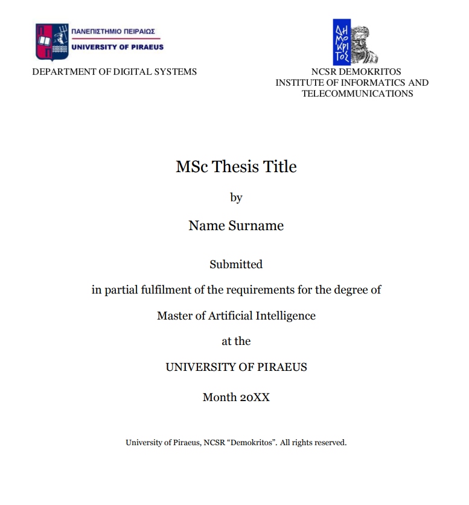

# MSc AI Thesis Template

## Overview

This is a LaTeX template for the Thesis implemented as part of the [Artificial Intelligence Masters Program](https://msc-ai.iit.demokritos.gr), organised by [Department of Digital Systems, University of Piraeus](https://www.unipi.gr/unipi/en/psif-home.html)  and the [Institute of Informatics and Telecommunications, NCSR Demokritos](https://www.iit.demokritos.gr/el/).

**Note!** This template is custom made based on the [doc](https://msc-ai.iit.demokritos.gr/sites/default/files/protypo_syggrafis_diplomatikis_ergasias__0.doc) file provided by the program. It is not officialy provided and hence may slightly differ from the origianal.

## Compilation

In order to run, view and edit the template first download this repository as a **zip** file.  

Then upload it on **Overleaf** or any other LaTeX environment and select XeLaTeX as the desired compiler.

The template should compile smoothly.

**(Note!)** The README.md and templateCover.png files are not required to be in the uploaded zip file.
